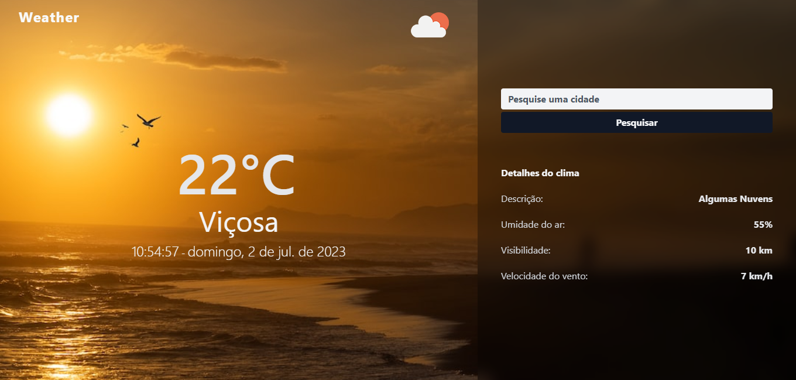

# Weather App
Este projeto é um web app que permite aos usuários pesquisar as condições meteorológicas de uma cidade específica. Ele exibe dados meteorológicos em tempo real, como temperatura, descrição, umidade, visibilidade e velocidade do vento. O aplicativo utiliza Tailwind CSS para estilizar e JavaScript para lidar com a funcionalidade. Ele também se integra à API do OpenWeatherMap para recuperar dados meteorológicos com base na entrada do usuário ou em sua localização atual, o app também consome a API do Unsplash para exibir imagens relevantes com base na descrição do clima.
<br>
<br>


# Recursos
A página possui os seguintes recursos relacionados ao design e funcionalidade:

- ## Desing
  - O design do aplicativo Web é responsivo e compatível com dispositivos móveis, graças ao uso das classes utilitárias do Tailwind CSS para layout e estilo.
  - A imagem de fundo da seção principal muda dinamicamente com base na descrição do clima obtida da API, criando uma experiência visual envolvente para os usuários.
  - Exibição do nome da cidade, temperatura atual, data e hora.
  - Ícone representando o clima atual da cidade.
  - Favicon personalizado de acordo com o clima da cidade.
  - Botão para exibir/ocultar detalhes adicionais sobre o clima.
  - Detalhes adicionais do clima, como descrição, umidade do ar, visibilidade e velocidade do vento.
 
- ## Funcionalidades
  - **Suporte de geolocalização:** o aplicativo utiliza a API [navigator.geolocation](https://developer.mozilla.org/en-US/docs/Web/API/Geolocation_API) para obter as coordenadas de localização do usuário (latitude e longitude) e buscar os dados meteorológicos para sua localização atual.
  - **Informações meteorológicas:** o aplicativo exibe informações meteorológicas essenciais, incluindo temperatura, descrição do tempo, umidade, visibilidade e velocidade do vento.
  - **Pesquisa:** Os usuários podem inserir o nome de uma cidade no campo de entrada e clicar no botão "Pesquisar" para obter informações sobre o clima dessa cidade. A pesquisa não diferencia maiúsculas de minúsculas e corta todos os espaços à esquerda/à direita.
  - **Tratamento de erros:** o aplicativo lida com erros normalmente e exibe uma mensagem de erro se a cidade não for encontrada ou se houver um problema com a solicitação da API.
  - **Relógio em tempo real:** o aplicativo exibe a hora atual, atualizando a cada segundo, para fornecer informações em tempo real aos usuários.

# Tecnologias
O projeto utiliza as seguintes tecnologias:

- **HTML:** Linguagem de marcação para estruturação da página web.
- **CSS (Tailwind CSS):** Framework CSS utilizado para estilização rápida e responsiva.
- **JavaScript:** Linguagem de programação para adicionar interatividade à página.
- **API de [Geolocalização do navegador](https://developer.mozilla.org/en-US/docs/Web/API/Geolocation_API):** Utilizada para obter as coordenadas geográficas da localização atual do usuário.
- **API do [OpenWeatherMap](https://openweathermap.org/api):** Utilizada para obter os dados climáticos de uma cidade com base nas coordenadas geográficas ou nome da cidade.
- **API do [Unsplash](https://unsplash.com/documentation):** Utilizada para buscar imagens relacionadas ao clima da cidade pesquisada.
- **SweetAlert2:** Uma biblioteca JavaScript usada para exibir mensagens de erro e alertas de forma visualmente atraente.

# Utilização
Para usar esse web app na sua máquina local siga estas etapas:


- Clone o repositório para sua máquina local utilizando o seguinte comando:
```bash
  git clone https://github.com/ViniciusQuintas/weather-app.git
```
- Após clonar o repositório, navegue até o diretório do app no terminal:
```bash
  cd weather-app
```
- Agora, abra a pasta `src` e em seguida abra o arquivo `index.html` no seu navegador para visualizar a página em ação. (Se você quiser testar o aplicativo em um servidor ativo, poderá usar um servidor de desenvolvimento local como o Live Server se estiver usando o Visual Studio Code)
  
- Ao carregar a página, o aplicativo tentará obter seus dados meteorológicos atuais com base em sua geolocalização. Se você permitir que o navegador acesse sua localização, o aplicativo exibirá informações meteorológicas para sua localização atual. Caso contrário, nenhuma imagem de fundo e dados climáticos serão exibidos.
  
- Para obter informações meteorológicas para uma cidade específica, digite o nome da cidade na entrada de pesquisa e clique no botão "Pesquisar". O aplicativo atualizará as informações meteorológicas e a imagem de fundo de acordo.
  
- O aplicativo também fornece mais detalhes sobre o clima para telas menores. Basta clicar no botão "Detalhes" para alternar a visibilidade de detalhes meteorológicos adicionais em dispositivos menores.

- ## Importante
  - A chave da API OpenWeatherMap e da API Unsplash foram fornecidas apenas como exemplo. Recomenda-se substituí-las por sua própria chave de API para garantir acesso ininterrupto aos dados meteorológicos e as imagens.
  
Sinta-se à vontade para modificar o código, adicionar novos recursos ou fazer melhorias de acordo com suas necessidades e preferências.

# Contribuição
Se você deseja contribuir para o desenvolvimento desse projeto, siga os seguintes passos:

 1️⃣ Faça um fork deste repositório. 
<br>
<br>
 2️⃣ Crie uma nova branch para sua contribuição. 
<br>
<br>
 3️⃣ Faça suas alterações no código. 
<br>
<br>
 4️⃣ Certifique-se de que suas alterações não quebram o funcionamento existente da página. 
<br>
<br>
 5️⃣ Faça um pull request com suas alterações. 
<br>
<br>

# Licença
Este projeto está licenciado sob a Licença MIT. Consulte o arquivo LICENSE para obter mais informações.
